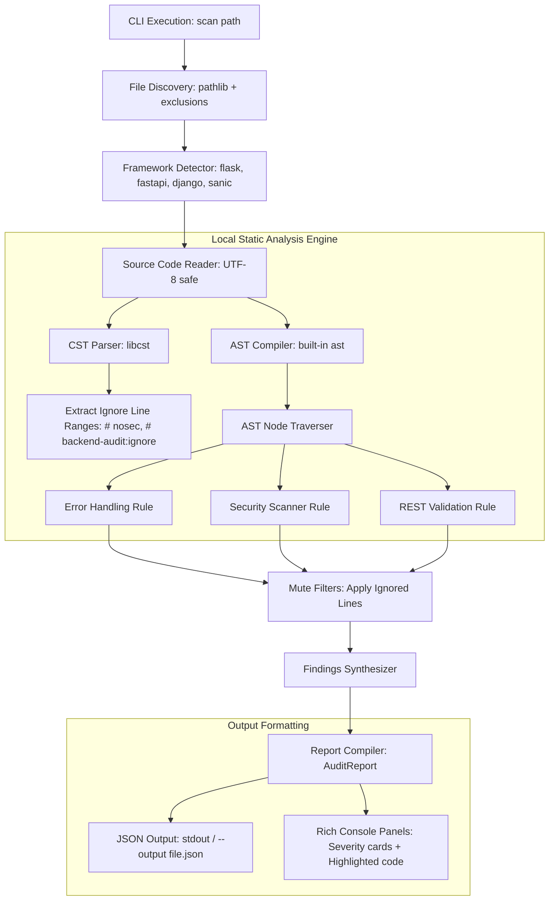

# backend-audit

[](https://www.python.org/)
[](LICENSE)
[](https://github.com/KhairnarLokesh/backendaudit-python-library)

An **offline-first, zero-network, local static analysis security, error handling, and code quality auditing tool** specifically built for Python backend applications. It scans web frameworks (Flask, FastAPI, Django, Sanic, and plain HTTP servers) using abstract syntax trees to flag vulnerabilities, weak practices, and REST standard violations before your code goes to production.

---

## 🔒 100% Offline-First & Privacy-Locked

This project is built from the ground up for strict **data privacy**:
* **No Cloud API Calls**: All analysis is performed entirely on your local machine. No external requests are made, and no code is ever transmitted to the cloud.
* **Pure AST/CST Engine**: Standard Python `ast` handles structured syntax trees, and `libcst` performs local comment parsing to verify muted findings.

---

## 🏗 System Architecture

The following diagram outlines the internal pipeline of `backend-audit` when executing a codebase scan:



### Analysis Pipelines
1. **File discovery**: Recursively searches the target path for `.py` files. Automatically ignores virtual environments (`venv`, `.venv`), configurations, tests, migrations, and build files.
2. **Framework auto-detection**: Looks at imports and file structures to detect the framework (FastAPI, Flask, Django, etc.) and adjusts testing rules accordingly.
3. **CST scanning**: Parses the concrete syntax tree via `libcst` to record lines marked with `# backend-audit:ignore` or `# nosec` for rule muting.
4. **AST scanning**: Walks the syntax tree structure to locate vulnerabilities, bad practices, and invalid status codes.
5. **Mute filters**: Excludes findings matching ignored lines before report generation.
6. **Report compile**: Formats the final `AuditReport` to be presented in standard terminal layout panels or exported as standard JSON.

---

## 🚀 Key Features & Rules

### 1. Automatic Error Handling Detection
* **Gaps in Route Handlers**: Flags endpoints that lack standard `try/except` wraps (`missing-try-except`).
* **Swallowed Exception Hazards**: Detects `except` blocks that catch exceptions and only log them using `print()` or logging objects without raising or returning a proper response (`error-only-logged`).
* **Global Configuration Issues**: Highlights projects missing global exception handlers and `404 - Not Found` route registrations in main server files (`missing-global-error-handler`, `missing-404-handler`).

### 2. Backend Security Scanner
* **Hardcoded Credentials**: Uses standard naming patterns and dynamic Shannon Entropy analysis to detect credentials, API keys, passwords, and tokens embedded in string literals (`hardcoded-secret`).
* **Route Protection Gap**: Flags sensitive endpoints (e.g. paths starting with `/admin` or `/api/private`) that lack authentication wrappers or DRF / FastAPI security dependency parameters (`unprotected-route`).
* **Command Injection**: Locates dangerous calls to `os.system()` or `subprocess` using `shell=True` with dynamically formatted parameters (`command-injection`).
* **SQL Injection**: Checks database raw execute methods that build query parameters via f-strings or manual string formats instead of parameterized query arguments (`sql-injection`).
* **Weak JWTs**: Flags signing calls using key literal values, `algorithm="none"`, or payloads missing `exp` (expiration) parameters (`weak-jwt-secret`, `weak-jwt-algorithm`, `weak-jwt-missing-exp`).
* **Dangerous Calls**: Detects dynamic python evaluations using `eval()` or `exec()` (`dangerous-pattern`).

### 3. HTTP Status Code & REST Validation
* **200 OK Error Responses**: Detects return statements inside error handlers or conditional fail blocks returning standard `200 - OK` responses (`error-response-status-200`).
* **Semantic Code Gaps**: Asserts that validation failures return `400 - Bad Request`, authentication failures return `401 - Unauthorized` or `403 - Forbidden`, and lookup failures return `404 - Not Found`.
* **Standard Descriptions**: Automatically appends standard descriptions (e.g. `"404 - Not Found"`) to all HTTP status code warnings.

---

## 📦 Installation

### From Source (Local Development)
Clone this repository and install in editable mode:
```bash
git clone https://github.com/KhairnarLokesh/backendaudit-python-library.git
cd backendaudit-python-library
pip install -e .
```

### Directly From GitHub (Production / CLI Utility)
You can install this command line scanner directly from the remote repository:
```bash
pip install git+https://github.com/KhairnarLokesh/backendaudit-python-library.git
```

---

## 💻 CLI Usage

Once installed, use the `backend-audit` command:

### 1. Basic Directory Scan (Auto-detects Framework)
```bash
backend-audit scan .
```

### 2. Scan Specific File or Subdirectory
```bash
backend-audit scan src/controllers/
```

### 3. Specify Framework Override
```bash
backend-audit scan . --framework fastapi
```

### 4. Output as JSON and Save to File
```bash
backend-audit scan . --format json --output report.json
```

---

## 🤫 Muting Warnings

To suppress a false positive or ignore an intentional coding practice, add an inline `# backend-audit:ignore` or `# nosec` comment to that line:

```python
# This hardcoded signature key will be ignored during scans
TEST_SECRET_KEY = "dummy-testing-signature-token-987"  # backend-audit:ignore

try:
    process_data()
except Exception as e:
    # This caught error print swallow will be ignored
    print("Logged only:", e)  # nosec
```

---

## 🧪 Running Tests

Ensure all tests pass before making modifications:
```bash
# Add PYTHONPATH to let pytest discover the source package
$env:PYTHONPATH="src"
python -m pytest tests/
```
